# Evaluation & benchmarks

## Evaluation protocol

Evaluation is its own config group. One override selects both the eval env
stack and the protocol:

```yaml
# configs/experiment/dqn/ale.yaml
defaults:
  - override /environment: ale
  - override /evaluation: ale       # pulls in ale_eval + cadence + episode count
```

```yaml
# configs/evaluation/atari100k.yaml
defaults:
  - none                                              # the base schema
  - override /environment@eval_environment: atari100k_eval
  - _self_

every_n_steps: 10_000    # periodic eval cadence in agent steps; 0 = final only
num_episodes: 10         # episodes per periodic eval point
final_num_episodes: 100  # official Atari-100k protocol
policy: eval             # eval | explore
canonical_source: eval   # which stream feeds charts/episodic_return
```

Shipped protocols: `none` (training stream only), `gym`, `ale`, `atari100k`,
`atari100k_native`, `dmc`. Any scalar is overridable — drop back to a single
final number with `evaluation.every_n_steps=0`.

Algorithms compared on the same benchmark select the same protocol, so their
curves are read off one axis: the three Atari-100k experiments all evaluate
every 10k steps and finish with the official 100 episodes, and the three DMC
experiments all evaluate every 10k steps on the deterministic policy.
`atari100k_native` is `atari100k` with `eval_environment` left `null` — the eval
env is a fresh instance of the experiment's own training stack. DreamerV3 uses
it because its 64x64 RGB stack cannot be served by the shared grayscale,
frame-stacked `atari100k_eval`, and does not need to be: that stack has no
episodic-life truncation and no reward clipping, so it already measures true
game scores.

Recurrent policies are safe to evaluate: the rollout advances with
`env.step_mdp`, the same transition the collector uses, so policy state carried
at the root of the tensordict (DreamerV3's RSSM) survives across steps.

The `_eval` env configs interpolate `name: ALE/${environment.task}-v5` — an
*absolute* reference, so composed under the `eval_environment` package they read
the train env's task. One `environment.task=Breakout` moves both envs.

`canonical_source` exists because the training stream is not always a true
score. On `atari100k`, `EpisodicLifeEnv` sets `terminated=True` at life loss, so
`RewardSum` resets there and a "training episode" is a life-long fragment —
those benchmarks measure from eval rollouts instead. On `ale`, torchrl's
`EndOfLifeTransform` deliberately does *not* set `done`, and `SignTransform`
sits after `RewardSum`, so training episodes already are unclipped game scores.

## Stages

`train:` and `eval:` are top-level flags:

```shell
python src/train.py experiment=dqn/gym eval=false     # skip the final evaluation
python src/eval.py  experiment=dqn/gym checkpoint.resume_from=logs/.../last.pt
```

`src/eval.py` logs to W&B like training does. By default it creates a separate
run tagged `eval`; add `logger.0.resume=must` to append the results to the
training run that produced the checkpoint (it reads the run id from the
`wandb_run.json` sidecar written next to the checkpoint).

## Benchmarking with openrlbenchmark

Runs are logged in a layout [openrlbenchmark](https://github.com/openrlbenchmark/openrlbenchmark)
can consume directly, so results can be compared against CleanRL, baselines,
Tianshou and friends without post-processing.

| W&B key | Meaning |
|---|---|
| `charts/episodic_return` / `_length` | canonical return, one row per episode (source per `canonical_source`) |
| `charts/train_episodic_return` / `_length` | always the training stream |
| `charts/eval_episodic_return` / `_length` | always eval rollouts |
| `eval/return_mean`, `_std`, `_min`, `_max`, `eval/episodes` | one row per eval point |
| `eval/final_return_mean` / `_std` | run summary: last `summary_window` canonical episodes |
| `train/*` | every algorithm-side metric: losses, exploration, schedules, update counts |
| `global_step` | **agent steps** (post frame-skip); on every row |
| `frames` | `global_step * environment.action_repeat`; on every row |

Run config carries top-level `env_id`, `exp_name` and `seed`. `env_id` omits the
`ALE/` prefix (`Pong-v5`), because openrlbenchmark's human-normalised-score
table is keyed that way and `ALE/Pong-v5` raises `KeyError`.

Three seeds, then compare:

```shell
python src/train.py -m experiment=dqn/ale trainer.seed=1,2,3

python -m openrlbenchmark.rlops --scan-history \
  --filters '?we=<entity>&wpn=torchrl-hydra-template&ceik=env_id&cen=exp_name&metric=charts/episodic_return' \
    'dqn?seed=1&seed=2&seed=3&cl=DQN (template)' \
  --env-ids Pong-v5 --output-filename compare
```

Three caveats worth knowing: openrlbenchmark skips runs that are not `finished`;
`--rliable` truncates every cell to the smallest seed count in the comparison,
so keep seed counts uniform across games; and a run that *crashed* still reports
as `finished`, because the trainer closes its logger in a `finally`. Check the
per-experiment runtimes `rlops` prints — a truncated run shows up there long
before it shows up in the curve.

`scripts/make_figures.sh` wraps this for the committed comparison groups.

### Multi-GPU benchmark sweeps

`scripts/run_benchmarks.sh` runs a fixed cross-algorithm sweep — PPO, BBF and
DreamerV3 on Atari-100k Jamesbond, plus PPO, TD-MPC2 and DreamerV3 on DMC
cheetah-run — at three seeds each, load-balanced across GPUs.

```shell
./scripts/run_benchmarks.sh --dry-run           # print the 18 commands
./scripts/run_benchmarks.sh --smoke             # tiny budgets; validates every spec
./scripts/run_benchmarks.sh --gpus 2,3          # the real sweep
./scripts/run_benchmarks.sh --only bbf,tdmpc2   # subset by job name
./scripts/run_benchmarks.sh --tag template-v2   # own W&B tag for this sweep
```

Use `--tag` whenever the evaluation protocol has changed since the last sweep.
W&B tags are the only thing separating one sweep from the next — old runs keep
their tag forever and still report as `finished`, and `rlops` cannot tell two
protocols apart. A tagged sweep plus `make_figures.sh --tag <name>` compares
only what belongs together.

Workers pull from a shared queue instead of taking a fixed slice, because the
jobs differ in cost by more than an order of magnitude — a static split would
leave a GPU idle for hours. Each finished run drops a marker in
`logs/benchmarks/done/`, so the sweep is interruptible and resumable. Runs are
tagged `template` for `scripts/update_algo_results.py`.

The job table carries **no** protocol overrides: every experiment's committed
`evaluation` config already reports the same thing as the others in its
comparison group. Anything a job needs beyond that belongs in its experiment
file, not in the table.

### Figures

`scripts/make_figures.sh` wraps openrlbenchmark's own `rlops` CLI — comparison
curves plus rliable aggregates, performance profiles and sample-efficiency
plots, with no plotting code of ours. It needs no adapters because the logging
contract above is what `rlops` expects; the first run builds an isolated
`.venv-openrlbenchmark` (openrlbenchmark's pins are kept away from the training
env).

```shell
./scripts/make_figures.sh                                    # every group, W&B tag `template`
./scripts/make_figures.sh --group atari100k                  # one comparison group
./scripts/make_figures.sh --tag template-v2 --full --publish # regenerate docs/figures/
```

`--full` matters: by default the script runs with openrlbenchmark's own
10-rep quick-test setting for rliable's Stratified Bootstrap CIs (sample
efficiency, performance profile, interval estimates), which is fine for
checking layout but too few reps to trust the interval widths. `--full`
switches to openrlbenchmark's recommended rep counts (50000 / 2000 / 2000);
use it for anything committed to `docs/figures/`. The three
`--bootstrap-reps-sample-efficiency` / `--bootstrap-reps-performance-profile`
/ `--bootstrap-reps-interval-estimates` flags override individually.

Figures are plotted on `charts/eval_episodic_return`, not the canonical
`charts/episodic_return`, so a comparison always shows the *same measurement*
for every algorithm in it. `canonical_source` is a per-experiment decision and
legitimate either way, but it means the canonical key is eval rollouts for BBF
and DreamerV3 and the training stream for `ppo/ale` — a stochastic-policy curve
next to two deterministic-protocol ones. On DMC the two keys are identical.

Read the script's header before trusting a plot. `rlops` averages the last 100
logged points of whatever metric it is given, from whatever stream produced it,
so runs recorded under different evaluation protocols are silently incomparable
— and a run whose episodes all sit at one step renders as a flat line, because
the single point is back-filled across the axis. Use `--tag` to keep one
sweep's runs together (see [Multi-GPU benchmark sweeps](#multi-gpu-benchmark-sweeps)).

## Benchmark results

Three seeds per algorithm, produced by `./scripts/run_benchmarks.sh --gpus 2,3
--tag template-v2` and plotted with `./scripts/make_figures.sh --tag
template-v2 --full --publish`. Shaded bands are ±1 std over seeds; every
number is the mean of the last 100 logged evaluation episodes.

**Read these as a template smoke test, not as a benchmark claim.** Each suite
here is a *single* task, so rliable's median / IQM / mean necessarily coincide
(visible below) and the performance profile is close to degenerate — those
panels only start carrying information across many tasks. Three seeds on one
task is also far too few to separate implementations that land close together.

### Atari-100k — Jamesbond

|              | DreamerV3      | BBF             | PPO           |
|:-------------|:---------------|:----------------|:--------------|
| Jamesbond-v5 | 385.33 ± 38.35 | 825.83 ± 309.25 | 25.67 ± 19.15 |

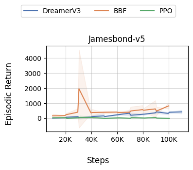

100k agent steps (400k game frames), 10-episode evaluations every 10k steps.
The ordering is the expected one — BBF, the sample-efficiency specialist,
clears DreamerV3, while PPO sits at random play (29.0 on this game) at a budget
it was never designed for. BBF's ±309 spread across three seeds is not noise in
the plot but the task: the official RR2 release reports mean ≈ 1125 over 14
seeds with min 573 and max 1490 (see
[BBF's README](../src/algorithms/bbf/README.md)), so our three seeds
(1251 / 702 / 524) sit inside that spread with the mean pulled low. The spike
near 30k is the same effect at a 10-episode measurement — which is why the
protocol also takes 100 episodes at the end.

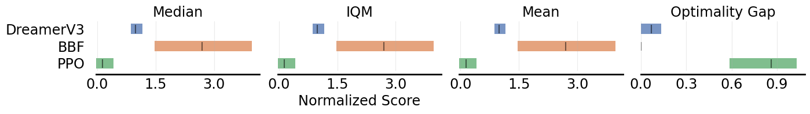
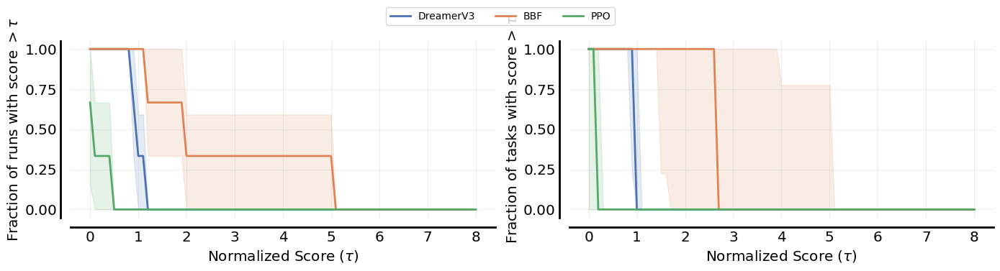
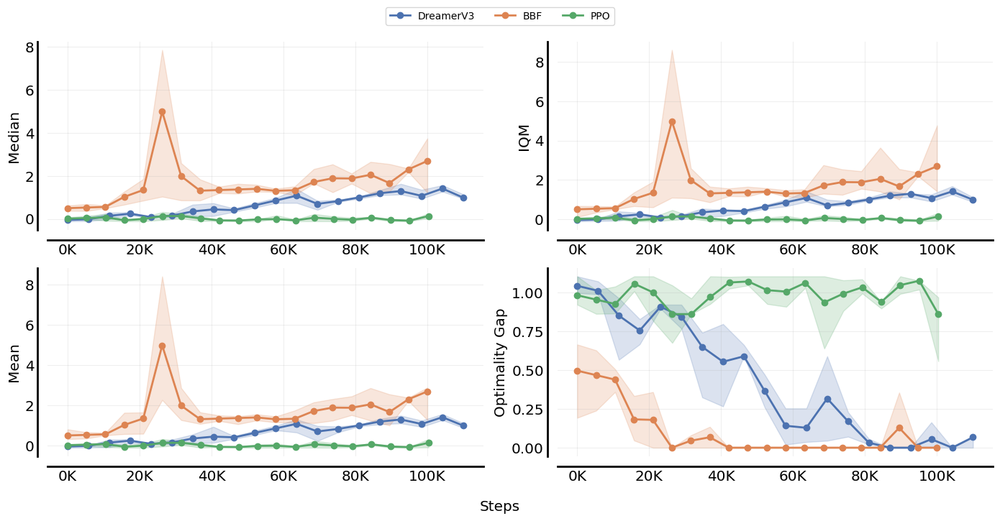
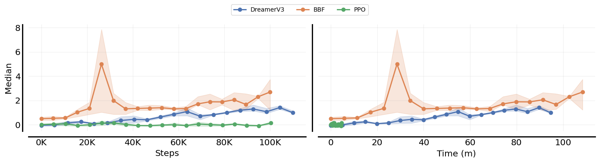

Scores are human-normalised with openrlbenchmark's Atari table (Jamesbond:
random 29.0, human 302.8), so 1.0 is human level.

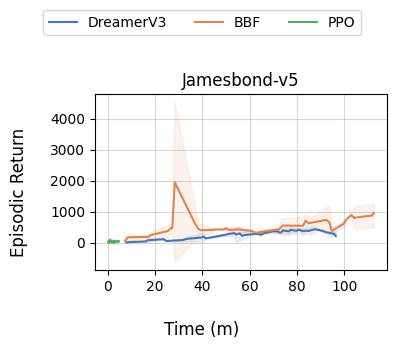

The same curves against wall-clock: at this budget BBF costs ~108 minutes per
seed on one GPU and DreamerV3 ~95, against PPO's ~5.

### DMC Proprio — cheetah-run

|             | DreamerV3      | TD-MPC2       | PPO            |
|:------------|:---------------|:--------------|:---------------|
| cheetah-run | 775.60 ± 65.02 | 907.27 ± 9.31 | 463.07 ± 93.30 |

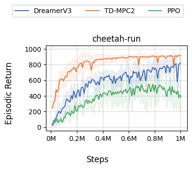

1M agent steps on state observations, 10-episode evaluations every 10k steps.
TD-MPC2 reaches ~900 within 200k steps and is the tightest across seeds
(±9.31) — above the 866.9 ± 11.1 this port measures from the *official*
`cheetah-run-1.pt` checkpoint (see
[TD-MPC2's README](../src/algorithms/tdmpc2/README.md)), which is the closest
thing here to a ground-truth reference. DreamerV3 is slower but still climbing
at 1M; PPO plateaus around 460. All three run the same `environment: dmc`
stack, so this is a like-for-like comparison.

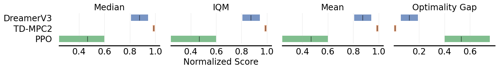
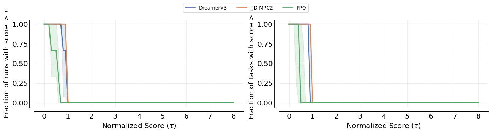
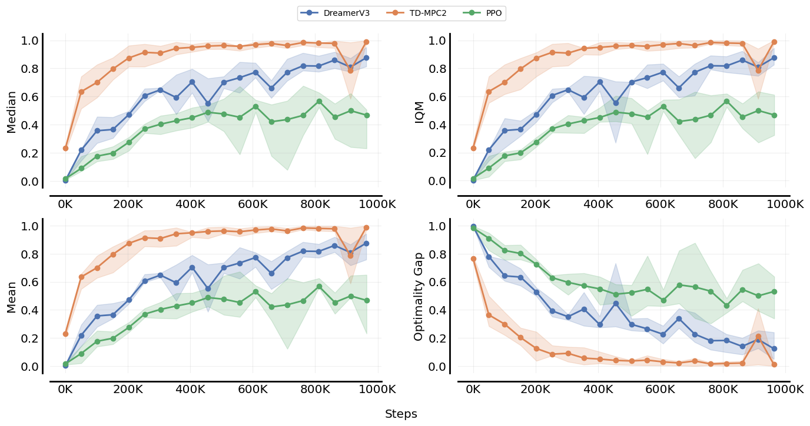
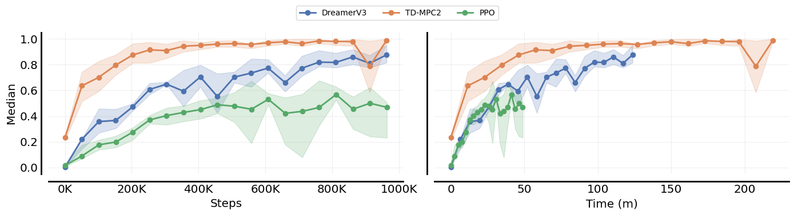

Scores here are min-max normalised over the runs in the comparison (no human
baseline exists for DMC), so 1.0 is the best run in the plot, not an absolute
ceiling.

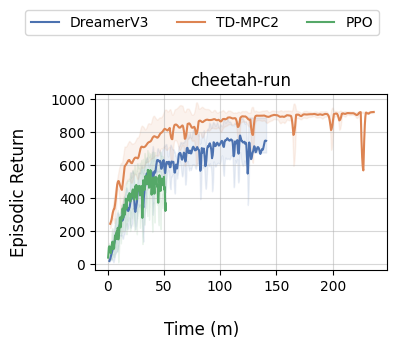

Against wall-clock the ranking shifts: TD-MPC2's ~900 costs ~219 minutes per
seed (MPPI planning dominates), DreamerV3 reaches ~775 in ~124, and PPO's ~460
takes ~49.
