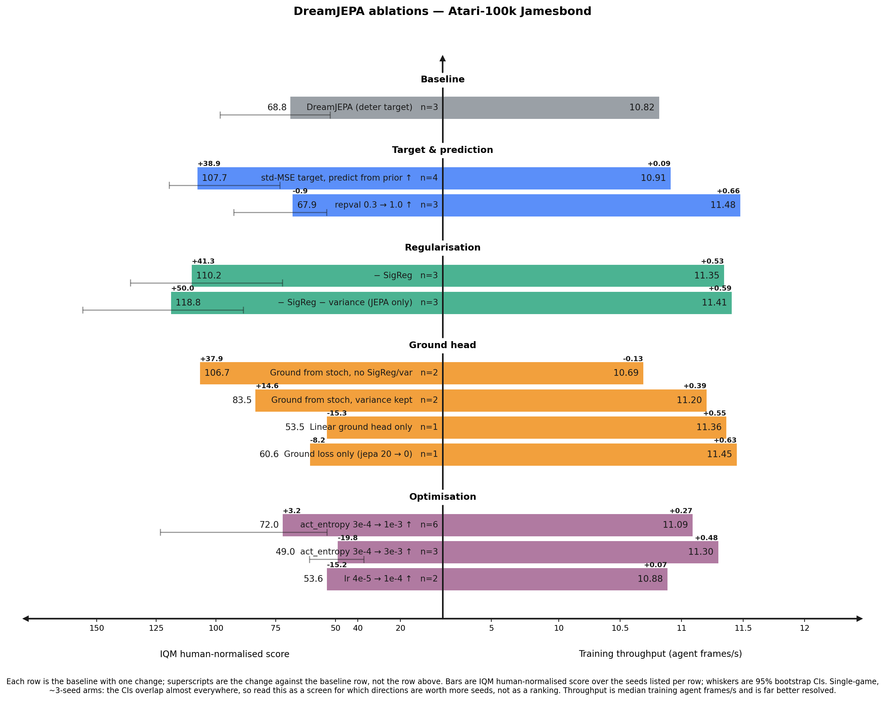

# Ablation figures

Butterfly ablation charts from W&B runs: one spine down the middle, **score
growing left**, **runtime growing right**, rows grouped into labelled sections.
Layout follows Rauch et al. (2025),
[*Can Masked Autoencoders Also Listen to Birds?*](https://arxiv.org/abs/2504.12880),
Figure 3.



```shell
./scripts/make_ablation_figure.sh --spec dreamjepa --fetch     # pull + draw
./scripts/make_ablation_figure.sh --spec dreamjepa             # redraw from cache
./scripts/make_ablation_figure.sh --spec dreamjepa --publish   # + docs/figures/
```

## How it works

Three layers, deliberately separated:

| | |
|---|---|
| `<spec>.yaml` | **Hand-written.** Sections, row order, labels, colours, axis breaks. Nothing is inferred from the data. |
| `--fetch` | Resolves each row's W&B query into `<spec>.csv` — one line per (arm, game, seed). |
| render | Reads the CSV only. No network, so restyling is free and the committed CSV reproduces the figure offline. |

Each row's `filters:` is passed **verbatim** to `wandb.Api().runs()`, so a row
selects on whatever its runs actually record:

```yaml
- label: − SigReg
  filters: {displayName: {$regex: "^djepa_nosigreg_s[0-9]+$"}}   # name convention

- label: TF32 matmuls +
  filters: {tags: {$in: [my-sweep]}, config.run_arm: tf32}       # tag + arm key

- label: Baseline
  filters: {name: {$in: [7n3l5mfi, fk717ez4]}}                   # explicit ids
```

`default_filters:` at the top of the spec is merged into every row (row keys
win) — the place for `state: finished` and a budget bound.

For new sweeps, `+run_arm=<name>` lands top-level in `wandb.config` and is the
cleanest handle:

```shell
python src/train.py experiment=dreamer/atari100k \
  logger.0.tags=[my-sweep] +run_arm=tf32 trainer.seed=1
```

## Important Settings

- **`delta_reference`** — `previous` gives the cumulative staircase (each row
  adds to the row above); `first` measures every row against the baseline, which
  is what a non-additive one-at-a-time ablation needs.
- **`confidence_intervals`** — off by default. On, whiskers are 95% bootstrap
  CIs via rliable's `StratifiedBootstrap` when an arm's runs form a complete
  seeds × games matrix, else a pooled percentile bootstrap. Rows with fewer than
  3 runs get no whisker.
- **`compress_below`** — the broken axis. Everything below it is squeezed into
  `compress_fraction` of the half-width, which is what keeps sub-point deltas
  legible. `auto` breaks just under the smallest bar; `null` for a linear axis.